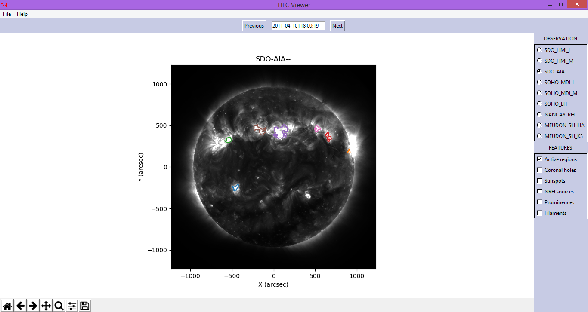
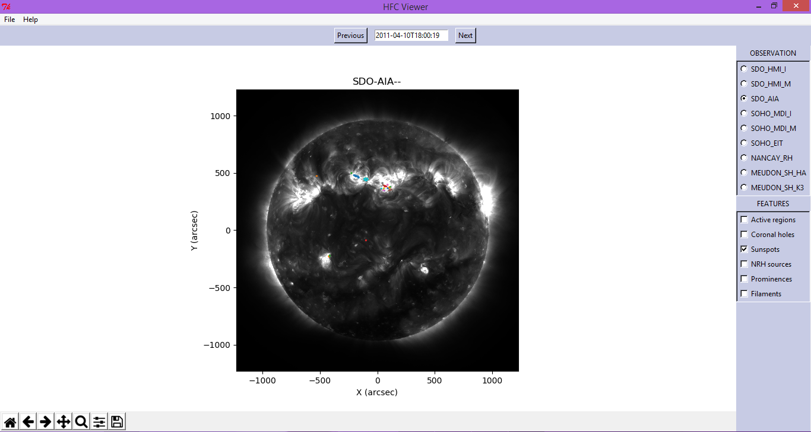

## HFC - Heliophysics Feature Catalogue

-------------------------------------

The Heliophysics Feature Catalogue provides access to existing solar and heliophysics feature data, extracted from images by automated recognition codes.

See the [Heliophysics page](http://voparis-helio.obspm.fr/hfc-gui/index.php)

#### Features

The features that are actively studied for checking HFC include the following

- [ ] Active Regions :
 - An active region on the Sun is an area with an especially strong magnetic field. Sunspots frequently form in active regions. Active regions appear bright in X-ray and ultraviolet images. Solar activity, in the form of solar flares and coronal mass ejections (CMEs), is often associated with active regions.

- [ ] Coronal Holes :
  - Coronal holes are areas where the Sun's corona is colder, hence darker, and has lower-density plasma than average because there is lower energy and gas levels. Coronal holes are part of the Sun's corona and are constantly changing and reshaping because the corona is not uniform.

- [ ] Sunspots
   - Sunspots are temporary phenomena on the Sun's photosphere that appear as spots darker than the surrounding areas. They are regions of reduced surface temperature caused by concentrations of magnetic field flux that inhibit convection.

- [ ] Prominence
 - A solar prominence (also known as a filament when viewed against the solar disk) is a large, bright feature extending outward from the Sun's surface.  - NASA/SDO

----------------------------------------

Apart from this there are also other solar features that are actively studied. In this repository we concentrate mainly on these features.

--------------------------------------------

#### Plotting the Features

##### Active Regions

Plotting Active Regions in the Solar Data.

* **SDO_AIA**

  

* **SDO_HMI_I**
  

--------------------------------------

## Sunspots

* **SDO_AIA**
  
